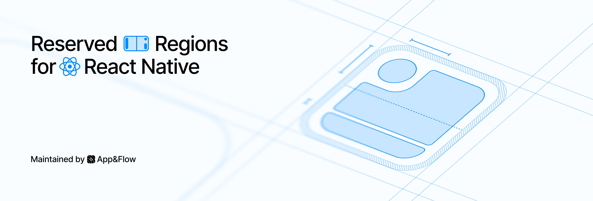

`react-native-reserved-regions` reports folds, hinges, cutouts, and system-reserved areas relative to your React Native views.

## Installation

1. Install the package:

   ```sh
   npm install react-native-reserved-regions
   ```

2. For iOS, install CocoaPods dependencies:

   ```sh
   cd ios
   bundle exec pod install
   cd ..
   ```

   Android requires no additional setup; React Native links the library automatically.

3. Rebuild your app.

:::info Requirements

- **React Native:** 0.80 or later with the New Architecture enabled.
- **iOS:** Receiving reserved regions requires building with the iOS 27.1 SDK or later and running on iOS 27.1 or later. The library works with older SDKs and runtimes but returns no reserved regions.
- **Android:** API 24 or later. Display cutouts require API 28 or later; fold information requires a supported device.

:::
